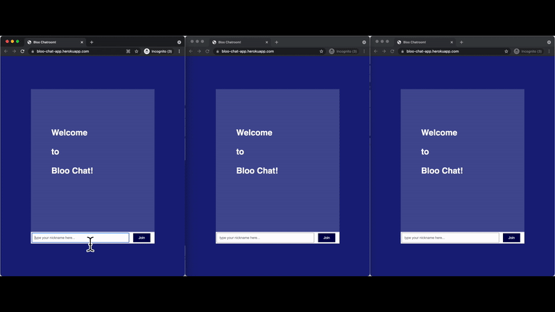

# Bloo Chat

A simple realtime messaging application build with Node, Express, and Socket.io.

After cloning the application, run `npm install` to install the dependencies. 

To run the application, use the command `npm run dev`.

The application is deployed on [Heroku](https://bloo-chat-app.herokuapp.com/).

## App Demo

## Basic App Description
##### index.njk 
> Basic homepage of the application. 

##### chatroom.njk
> The chatroom of the application. This nunjucks template inherits the homepage 
>and adds the chatroom, script.js, and socket.io.js to the application.

##### script.js
> This serves as the client side script. This script is run once the user joins 
>the chatroom by entering his name from the homepage. Once it joins the chatroom, 
>it emits a "login" with the username so that the server can send messages to the 
>other users that a new user joined. Then, it listens to "submit", which is passed 
>once the user enters a message onto the chat box and presses the send button. 
>A "message" is emitted to the server so it can be handeled. The script also 
>listens to the server for various types of messages, and prints it to the user 
>with proper formatting.

##### index.js
> This serves as the server side script. The script uses nunjucks for html file 
>templating, uses express.js as the web framework for Node.js, and uses socket.io 
>as a WebSocket for real time communication between the client and server scripts. 
>First, there are html get requests each of the two nunjucks templates. The script 
>listens for a user that connects to the application. Once a user connects, it 
>will receive a "login" type from the client side with the user name. It will then
> use it to emit a "user has joined" message to all users except for himself, and 
>emit a "welcome message" and a "list of online users" message for the client side 
>script to receive, format, and print to the user's webpage. It will then add the 
>user onto a object that lists the online users as key value pairs. It will then 
>listen to a type "message" for the client side script to emit. Once it receives 
>the "message" it emits the message to every user. The program also listens for a 
>"disconnect", which then emits a "disconnect-message" to send to every user, 
>then deletes the user from the object of online users. 